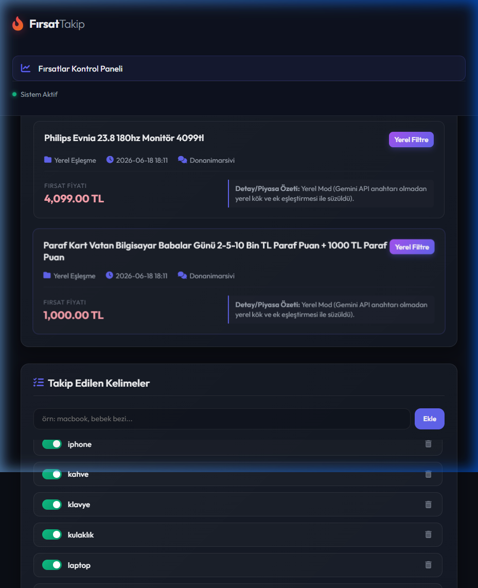
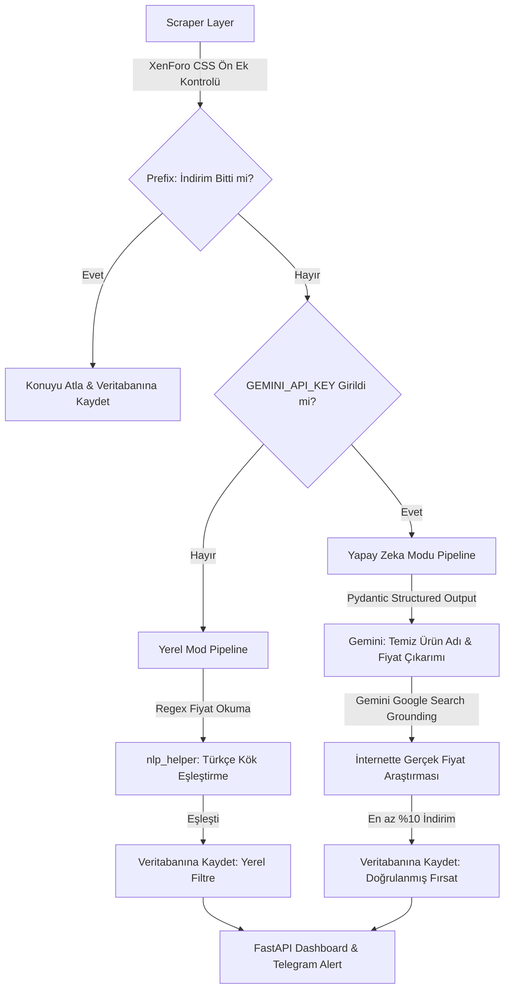

# 🌌 Akıllı İndirim Takip ve Doğrulama Sistemi (Smart Deal Tracker)

> **TR:** Forum indirimlerini asenkron kazıyan, Türkçe NLP (Lemmatizer/Stemmer) motoru ile süzüp Gemini API ve Google Search Grounding ile gerçek zamanlı piyasa doğrulaması yapan çift modlu indirim takip otomasyonu.
>
> **EN:** An asynchronous, modular web scraping pipeline that extracts discounts from online forums, screens them using custom Turkish NLP stemming, and verifies market prices in real-time using Gemini Google Search Grounding.

[](https://www.python.org/)
[](https://fastapi.tiangolo.com/)
[](https://ai.google.dev/)
[-003b57.svg)](https://sqlite.org/)

**Sıcak Fırsatlar Takip**, e-ticaret ve fırsat forumlarındaki indirim paylaşımlarını asenkron olarak kazıyan, Türkçe dil yapısına uygun (çekim ekleri ve ünsüz yumuşamasını çözen) yerel bir NLP filtresinden geçiren ve **Gemini API & Google Search Grounding** ile piyasadaki gerçek fiyatları canlı olarak doğrulayan yapay zeka destekli bir otomasyon sistemidir.

### 📸 Kontrol Paneli Görünümü (Dashboard Preview)


---

## 🌟 Öne Çıkan Özellikler

### 🔌 Çift Modlu Esnek Mimari (Dual-Mode)
* **Yerel Mod (Zero-Setup)**: API anahtarı gerekmeden doğrudan çalışır. Forumdaki ön eklerden (`🔥 İndirim` / `❌ İndirim Bitti!`) indirim durumunu analiz eder ve yerel Türkçe NLP motoruyla süzerek dashboard'da listeler.
* **Yapay Zeka Modu (Gemini)**: `.env` dosyasına `GEMINI_API_KEY` girildiği anda aktif olur. Gemini modeli ürün adını ve fiyatını yapılandırılmış veri (Pydantic Structured Output) olarak temizler, internette fiyat araştırması yapıp gerçek indirimleri doğrular ve Telegram'a raporlar.

### 🧠 Akıllı Türkçe NLP Filtre Motoru
Türkçe sondan eklemeli bir dil olduğu için basit kelime aramaları çekim ekleri aldığında veya ünsüz yumuşaması yaşandığında eşleşmeleri kaçırır. Projedeki yerel NLP motoru:
* Özel Türkçe büyük/küçük harf normalizasyonu yapar (`İ` -> `i`, `I` -> `ı`).
* İsim çekim, iyelik ve çoğul eklerini (`-leri`, `-ında`, `-yle` vb.) temizler.
* Ünsüz yumuşamalarını tersine çevirerek kök harfleri eşleştirir:
  * `kulaklığı` ➔ ek atılır: `kulaklığ` ➔ yumuşama geri alınır: **`kulaklık`**
  * `bebeği` ➔ ek atılır: `bebeğ` ➔ yumuşama geri alınır: **`bebek`**

---

## 📋 Sistem Mimarisi



---

## 🚀 Kurulum ve Çalıştırma

### 1. Depoyu Klonlayın ve Bağımlılıkları Yükleyin
```bash
git clone https://github.com/erkinavcii/Sicakfirsatlar-indirim-takip.git
cd SıcakFırsatlarTakip

# Bağımlılıkları yükleyin
pip install -r requirements.txt
```

### 2. Yapılandırma Dosyasını Ayarlayın
`.env.example` dosyasını `.env` adıyla kopyalayın:
```bash
cp .env.example .env
```
* **Yerel Mod için**: `.env` dosyasını düzenlemenize gerek yoktur. Sistem doğrudan yerel kurallarla çalışacaktır.
* **Yapay Zeka Modu için**: `.env` içindeki `GEMINI_API_KEY` ve `TELEGRAM_` alanlarını kendi bilgilerinizle doldurun.

### 3. Uygulamayı Başlatın
```bash
python main.py
```
Uygulama başladığında:
* SQLite veritabanını (`database.db`) otomatik olarak oluşturacaktır.
* Kontrol panelini `http://127.0.0.1:8000` adresinde ayağa kaldıracaktır.
* Arka planda 10 dakikada bir otomatik tarama yapacak zamanlayıcıyı (scheduler) başlatacaktır.

---

## 📁 Proje Dosya Yapısı

* `main.py`: Uygulamanın giriş noktası (FastAPI + Scheduler).
* `pipeline.py`: Tarama, NLP süzgeci ve doğrulama akışının asenkron orkestratörü.
* `scheduler.py`: Periyodik taramaları yöneten zamanlayıcı.
* `config.py`: Çevresel değişkenleri yükleyen ayar dosyası.
* `database/db.py`: `aiosqlite` ile asenkron SQLite CRUD operasyonları.
* `scrapers/`:
  * `base.py`: Web kazıcılar için ortak HTTP ve User-Agent şablonu.
  * `donanim_arsivi.py`: Donanım Arşivi forumunu tarayan XenForo kazıcısı.
* `services/`:
  * `nlp_helper.py`: Yerel Türkçe Lemmatizer/Stemmer motoru.
  * `gemini_service.py`: Gemini API yapılandırılmış çıktı ve Google arama grounding entegrasyonu.
  * `telegram_service.py`: Telegram indirim kartı bildirim servisi.
* `dashboard/`: FastAPI web sunucusu, CSS dosyaları ve HTML Jinja2 şablonları.

---

## 🛠️ Yeni Siteler Eklemek (Geliştirici Rehberi)

Yeni bir kazıcı eklemek için `scrapers/` klasöründe `BaseScraper` sınıfından türetilmiş yeni bir sınıf yazmanız yeterlidir. Ayrıntılı yönergeler için [walkthrough.md](walkthrough.md) dosyasını inceleyebilirsiniz.
