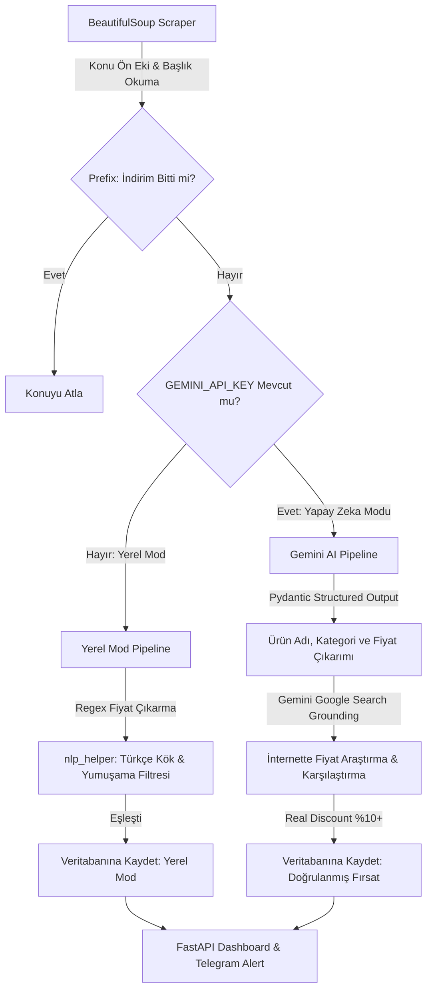

# 📋 Akıllı İndirim Takip ve Doğrulama Sistemi - Proje Planı

Bu döküman, projenin vizyonunu, amacını, teknik mimarisini ve geliştirme adımlarını detaylandırmaktadır. Proje, hem yerel (API anahtarsız) hem de yapay zeka destekli çift modlu (Dual-Mode) bir yapıya sahip olacak şekilde tasarlanmıştır.

---

## 1. Projenin Amacı ve Vizyonu

### 👤 Kullanıcı Bakış Açısıyla (Sizin Vizyonunuz)
* **Temel Amaç**: Türkiye'deki sıcak fırsat forumlarından (özellikle Donanım Arşivi Sıcak Fırsatlar) anlık olarak indirim paylaşımlarını takip etmek.
* **Filtreleme & Elemeler**: İndirimi biten veya süresi dolan fırsatları ayıklamak, sadece ilgilendiğimiz kelimelerle (örn: *monitör, bebek bezi, kahve*) eşleşenleri süzmek.
* **Doğrulama**: Forumda paylaşılan fiyatın gerçekten indirim olup olmadığını anlamak için Google arama motorunu kullanıp ürünün piyasadaki güncel fiyatını sorgulamak ve doğrulamak.
* **Raporlama**: Doğrulanan gerçek indirimleri Telegram botu/kanalı üzerinden anlık bildirim olarak veya şık bir kontrol panelinden izlemek.

### 🧠 Yapay Zeka Bakış Açısıyla (Antigravity Analizi)
* **Gelişmiş Mimari**: Basit bir web kazıma scriptinin ötesinde; asenkron, olay güdümlü ve dayanıklı bir sistem.
* **Çift Modlu Esneklik (Dual-Mode)**: Kullanıcının API anahtarı olmadığında bile çalışabilen (Lite Mod) ve API anahtarı eklendiğinde tam yapay zeka doğrulamasına yükselen (Pro Mod) esnek kod mimarisi.
* **Yerel NLP Çözümü**: Türkçe dilinin sondan eklemeli ve ünsüz yumuşaması içeren yapısına uygun (`kulaklığı` -> `kulaklık`), dış kütüphane bağımlılığı olmadan çalışan yerel bir Türkçe NLP (Lemmatizer/Stemmer) motoru entegrasyonu.
* **Yapay Zeka Destekli Doğrulama**: Gemini'ın entegre **Google Search Grounding** aracını kullanarak ek bir Google Search API ücreti ödemeden, LLM'in internette canlı fiyat araştırması yapmasını sağlamak.

### 🌌 Birleşik Ortak Vizyon
Geliştiricilerin repoyu klonlayıp **sıfır kurulumla** çalıştırabileceği, Türkçe çekim eklerine ve ünsüz değişimlerine duyarlı bir yerel filtreleme motoru sunan; aynı zamanda tek bir çevresel değişkenle (`GEMINI_API_KEY`) **Gemini Arama Ajanı** ve **Telegram Bildirim Servisi** gibi pro özellikleri aktif eden, GitHub vitrini için prestijli ve üretime hazır (production-ready) bir akıllı indirim takip sistemi oluşturmak.

---

## 2. Sistem Mimarisi ve Katmanları

---

## 3. Geliştirme Yol Haritası ve Görevler

### 🛠️ Adım 1: Yerel Türkçe Dil Motoru (`services/nlp_helper.py`)
* Türkçe karakter normalizasyonu (büyük/küçük harf duyarlılığı).
* Kelimelerin sonundaki Türkçe çekim eklerini temizleyen kural tabanlı yapı.
* Ünsüz yumuşamasını (`ğ` -> `k`, `b` -> `p`, `d` -> `t`, `c` -> `ç`) tersine çeviren dönüşüm motoru.
* Anahtar kelime kökleriyle başlık stems'lerini eşleştiren ana metodun yazılması.

### 🔍 Adım 2: Konu Ön Eki ve Fiyat Regex Yakalayıcı (`scrapers/donanim_arsivi.py`)
* XenForo forumundaki ön ek etiketlerini (`🔥 İndirim` veya `❌ İndirim Bitti!`) CSS seçicileri ile yakalama.
* Ön eki `❌ İndirim Bitti!` olan konuları otomatik olarak `is_expired = True` işaretleme.
* Yerel modda kullanılmak üzere forum başlığından fiyatı (örn: *4099tl* veya *1.500 ₺*) bulup float'a çeviren regex fonksiyonu ekleme.

### ⚙️ Adım 3: Çift Mod Destekli Pipeline (`pipeline.py`)
* API anahtarının varlığına göre `SYSTEM_MODE` kontrolü.
* Yerel modda `nlp_helper` eşleştirmesini ve regex fiyat okumasını çalıştırma.
* AI modunda mevcut Gemini structured output ve arama grounding motorunu çalıştırma.

### 🎨 Adım 4: Kontrol Paneli ve Arayüz Güncellemeleri (`dashboard/`)
* Kartlara "Yerel Filtre" (Mavi) ve "Yapay Zeka Doğrulaması" (Mor/Yeşil) rozetleri ekleme.
* Karşılaştırma fiyatı (`market_price`) yerel modda bulunmadığında arayüzde kırılma olmamasını sağlama (Jinja2 koşul blokları).
* CSS'te premium glassmorphism detaylarını rozetlerle zenginleştirme.

### 📝 Adım 5: Prestijli README.md Dokümantasyonu
* GitHub vitrini için görseller, badges, özellik karşılaştırma tablosu ve hızlı başlangıç rehberi ekleme.

### 🚀 Adım 6: GitHub Actions ve Bulut Otomasyonu Entegrasyonu
* Sistem için tek seferlik çalışıp kapanan `run_once.py` betiğinin hazırlanması.
* Otomatik zamanlanmış ve manuel tetiklenebilir `.github/workflows/` dosyalarının oluşturulması.
* SQLite `database.db` veri kalıcılığı için **Dynamic Cache Rolling** (Dinamik Önbellek) mekanizmasının kurulması.
* Kurulum ve yapılandırma secrets detaylarının yer aldığı `docs/github-actions-setup.md` dokümanının yazılması.

